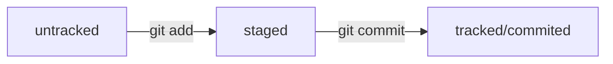

# Шпаргалка по работе с Git

## Как связать локальный и дистанционный репозитории?  
1. Нужно перейти в ваш локальный репозиторий: `cd /путь к папке/`.  
2. Пишем команду: `git init`, в папке должен появится скрыйтый файл `.git`.  
3. `git add --all` или `git add 'имя определенного файла с расширением'` — добавляем файлы.  
4. Делаем коммит — `git commit -m 'комментарий'`.  
5. Далее нужно сгенерировать __SSH-ключ__, подробнее как это сделать можной найти здесь [интрукция](https://practicum.yandex.ru/trainer/git-basics/lesson/42435683-0922-4231-bfb4-d7d32d61f50a/ "Яндекс Практикум").  
6. Копируем SSH-ключ в буфер обмена командой `clip < ~/.ssh/id_rsa.pub` или `clip < ~/.ssh/id_ed25519.pub `.  
7. Затем нужно зайти в __настройки__ на GitHub в __SSH and GPG keys__ и пернести туда публичный SSH-ключ.  
8. Открываем свой репозиторий на GitHub, в разделе `Quick setup — if you've done this kind of thing before` выбираем SSH, копируем.
9. Далее вводим команду `git remote add origin 'вставляем, что скоировали'`.  
10. Можно убедиться, что репозитории связаны: `git remote -v`, вы должны увидеть 2 файла: `(fetch)` и `(push)`.  
11. Пишем `git push -u origin master`, если будет ошибка, то `master` заменить на `main`.  
12. В следующий раз можно писать просто `git push`.

---

## Полезные команды:  
* Узнать, где вы сейчас находитесь — `pwd`.  
* Сменить директорию — `cd`.  
* Вывести содержимое директории `ls`; `ls -a` — отобразятся все скрытые файлы.  
* Создать файл (.txt) — `touch`.  
* Создать директорию — `mkdir`.  
* Создать структуру директорий — `mkdir -p`.  
* Копирование файлов — `cp`.  
* Чтение файлов (только .txt) — `cat`.  
* Удалить файл — `rm`.  
* Удалить папку — `rmdir`; вместе с ее содержимым — `rm -r` (файлы удаляются навсегда, их не будет даже в корзине).  
* Разделение нескольких команд — `&&`.  
* Инициализация локального репозитория — `git init`.  
* Подготовить файл к сохранению — `git add`; все файлы в директории — `git add --all`; всю папку целиком — `git add .`.  
* Сделать коммит — `git commit -m 'комментарий'`.  
* Отправка изменений на удаленный репозиторий — `git push`.  
* Если нужно дополнить последний коммит — `git commit --amend --no-edit`.  
* Если нужно изменить сообщение коммита — `git commit --amend -m "Новое сообщение"`.  
* Откатить» коммит до коммита с хешем `<hash>` — `git reset --hard <commit hash>`.  
* Выполнить unstage изменений (после `git add`) — `git restore --staged <file>`.  .  
* «Откатить» изменения, которые не попали ни в staging, ни в коммит (файлы modified) — `git restore <file>`.  
* Показать игнорируемые файлы — `git status --ignored`.  
* Посмотреть изменения — `git diff`.  
* Вывести роазницу между двумя коммитами — `git diff a9928ab 11bada1` (начало потом конец).  
* Показать изменения, которые добавлены в staged-файлах — `git diff --staged`.  
* Команда `git clone` копирует и автоматически связывает локальный и удалённый репозиторий.  
* Забрать изменения из удалённого репозитория — `git pull`.  
* `git merge --no-edit --no-ff new-branch` — если отключить слияние в режиме fast-forward, то есть ветки __не сольются в одну__, а будет создан __новый коммит__ в ветке main; `--no-edit` отключает ввод сообщения для merge-коммита; `--no-ff` отключает fast-forward слияние веток.  

### Ветки:  
* Просмотреть все ветки проекта можно командой `git branch`.  
* Изменения в одной не влияют на изменения в другой.  
* `feature` — для веток, где прорабатывается новая функциональность.  
* `bugfix` — для веток, где ведётся работа по исправлению ошибок.  
* ` git branch <название ветки>` — создать новую ветку.  
* Переключиться на другую ветку — `git checkout <название_ветки>`.  
* Создать ветку и сразу переключиться на неё — `git checkout -b <название_ветки>`.  
* Сравнить ветки — `git diff <название_ветки1> <название_ветки2>`; в действующей ветке можно использовать `head`.  
* Выполнить слияние — `git merge <название_ветки>`; перед началом нужно перейти в ветку, куда будут внесены изменения.  
* Удалить ветку после объединения — `git branch -D <название_ветки>`.  

---

## Основные понятия  
* `Хеш → информация о коммите`. Если вы знаете хеш, вы можете __узнать__ всё остальное: __автора__ и __дату__ коммита и __содержимое__ закоммиченных файлов.  
* __Суффикс навигации__ `~` → Нумерация начинается с нуля: `commit~0` — это сам коммит, `commit~1` — предыдущий, `commit~2` — предшествующий предыдущему и так далее, если считать с последнего выполненного коммита. Для `~1` есть специальное сокращение `~` (без числа).  
* __«мёржить»__ ветки — объединять их.  
* У команды `git branch -D` есть более безопасный вариант с флагом `-d`. Он __удалит ветку__ только если она была полностью объединена с другой.  
* __Выйти из редактора Vim__: нажать `Esc`, ввести `:qa!`, нажать `Enter`.  
* __Пул-реквест__ — это запрос на рассмотрение предлагаемых изменений и часть процесса ревью.  

---

## Схема для удобства

---

## .gitignore  
* Это текстовый файл.  
* `*` — любая строка.  
* `?` — один любой символ.  
* `[...]` — один символ из списка; можно `[abc]` или `[a-c]`.  
* `/` — указывает на каталоги. Если шаблон в .gitignore начинается со слеша, то Git проигнорирует файлы или каталоги только в корневой директории.  
* `**` — двойная звёздочка может соответствовать любому количеству таких папок, одинарная – только одной.  
* `!` — добавление исключений.  

---

## О feature branch workflow — один из самых простых и популярных подходов  

### Основные правила:  
* новая функциональность или исправление — новая ветка;  
* когда код в `feature`-ветке готов, он вливается в `main`;  
* в `main` всегда рабочая версия без «недоделок».  
### Преимущества:  
* простая модель;  
* позволяет работать с Git в команде без лишних технических сложностей.  

